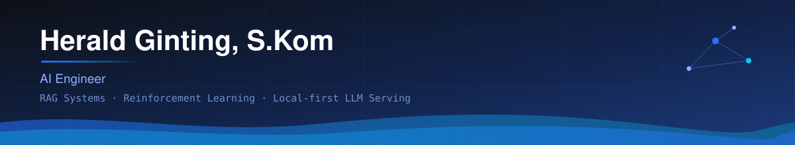

  

 

## About

**AI Engineer** dengan latar Informatika (S.Kom). Fokus di sistem RAG produksi, reinforcement learning multi-agent, dan LLM serving yang efisien di hardware terbatas. Sampingan di Web3 — smart contract dan DeFi primitives.

Prinsip kerja: **ukur dulu, klaim belakangan.** Setiap angka di bawah punya konteks hardware dan bisa direproduksi dari repo-nya.

 

## Tech Stack

`RAG` · `Reinforcement Learning` · `Ray RLlib` · `MLflow` · `ChromaDB` · `llama.cpp` · `Quantization` · `Hardhat` · `OpenZeppelin`

 

## Featured Projects

### [MicroLLM-PrivateStack](https://github.com/loxleyftsck/MicroLLM-PrivateStack) — Private LLM Infrastructure

LLM stack lokal, zero external API call. DeepSeek-R1-1.5B (Q4) via llama-cpp-python.

Benchmark di **Intel i5-12400, 2GB RAM**:

| Metrik | Hasil |
| :--- | :--- |
| Inference (uncached) | 280 ms |
| Inference (cached) | **18 ms** — 15.5x lebih cepat |
| Cache lookup (SoA-optimized) | 0.2 ms |
| Throughput | 450 req/s dengan caching |
| Security overhead | < 50 ms per request |

OWASP ASVS Level 2 · prompt-injection guard · PII masking otomatis · Docker + K8s
`Flask` `llama-cpp-python` `SQLite` `JWT` `Electron` — 61 commits, MIT

---

### [IndoGovRAG](https://github.com/loxleyftsck/IndoGovRAG) — Regulatory RAG untuk Peraturan Pemerintah

Hybrid retrieval (BM25 + vector) di atas ChromaDB, generation via Gemini API. 53 chunk dokumen dari 17+ kategori regulasi.

Response time masih 10–60 detik karena keterbatasan free-tier API — bukan masalah arsitektur, tapi belum diselesaikan.

`FastAPI` `Next.js 14` `ChromaDB` `Gemini` — CI/CD, test suite, Docker, 59 commits

---

### [EquilibriumX](https://github.com/loxleyftsck/EquilibriumX-Multi-Agent-Negotiation-Sandbox) — Multi-Agent Negotiation Sandbox

Platform negosiasi hybrid: RL agent + LLM untuk komunikasi bahasa natural. Distributed training via Ray RLlib, eksperimen dilacak dengan MLflow.

`Python` `Ray RLlib` `MLflow` — notebooks, docs, draft paper, 25 commits

<!-- TODO Herald: klaim "95% konvergensi Nash dalam <100 iterasi" belum ada di README repo.
     Taruh tabel hasil + script reproduksi di repo dulu, baru tulis angkanya di sini. -->

---

### [bnb-staking-dapp](https://github.com/loxleyftsck/bnb-staking-dapp) — DeFi Staking Protocol

BEP-20 token (HLD, max supply 10M) + StakingPool dengan reward akrual per detik, APR 10%, emergency withdrawal.

- **37 test lulus** (Chai + Hardhat)
- Gas: stake ~75.000 · unstake ~85.000 (termasuk mint reward)
- ReentrancyGuard, role-based minting, pausable

`Solidity 0.8.20` `OpenZeppelin v5.4.0` `Hardhat 2.22` — BSC Testnet, MIT

> Testnet only — belum diaudit eksternal, jangan dipakai dengan dana riil.

<!-- TODO Herald: klaim "30% gas savings" butuh baseline pembanding.
     Ukur staking pool standar, buat tabel before/after. Kalau tidak, angka gas absolut di atas sudah informatif. -->

---

### [CARL-DTN](https://github.com/loxleyftsck/CARL-DTN) — Context-Aware RL Routing

Protokol routing untuk Delay Tolerant Network: Q-Learning + evaluasi konteks multi-dimensi (resource fisik, metrik sosial, properti pesan) + adaptive copy control berbasis densitas jaringan.

Dievaluasi terhadap Epidemic, PRoPHET, dan Spray-and-Wait pada delivery probability, overhead ratio, dan latency.

`Java` `ONE Simulator v1.4.1` `Fuzzy Logic (FCL)` — GPL v3

<!-- TODO Herald: hasil numerik benchmark belum ada di README repo. Tambahkan tabel hasilnya di sana. -->

 

## Current Focus

- **Building** — Inverse RL agent untuk optimasi portofolio kripto (`Stable-Baselines3`). Baseline pembanding: HODL.
- **Researching** — ZK-SNARK privacy layer untuk DAO governance. Target: draft paper ICBC.
- **Learning** — Harness engineering & eval-driven development untuk sistem agentic.

 

## Connect

<!--
CATATAN DEPENDENSI EKSTERNAL
=============================
Yang dipakai di file ini:
  - ./assets/banner.svg   -> milik sendiri, di repo. Tidak akan pernah mati.
  - skillicons.dev        -> terbukti jalan di tes kamu
  - img.shields.io        -> infrastruktur besar & stabil, dipakai jutaan repo

Yang SENGAJA DIHAPUS karena gagal render di tes kamu:
  - capsule-render.vercel.app          (banner header & footer)
  - github-readme-stats.vercel.app     (stats card)

Kalau tetap mau stats card: JANGAN pakai instance publik.
Deploy sendiri (gratis, ~5 menit):
  1. Fork  https://github.com/anuraghazra/github-readme-stats
  2. Import repo hasil fork ke Vercel
  3. Ganti URL jadi  https://<nama-project>.vercel.app/api?username=loxleyftsck
Instance sendiri = tidak berbagi rate limit dengan siapa pun.
-->
