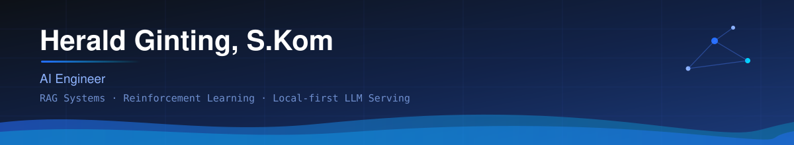

  

 

## About

**AI Engineer** with a background in Informatics (S.Kom). I work on production RAG systems, multi-agent reinforcement learning, and efficient LLM serving on constrained hardware. On the side, Web3 — smart contracts and DeFi primitives.

Working principle: **measure first, claim second.** Every number below comes with its hardware context and can be reproduced from the corresponding repository.

 

## Tech Stack

`RAG` · `Reinforcement Learning` · `Ray RLlib` · `MLflow` · `ChromaDB` · `llama.cpp` · `Quantization` · `Hardhat` · `OpenZeppelin`

 

## Featured Projects

### [MicroLLM-PrivateStack](https://github.com/loxleyftsck/MicroLLM-PrivateStack) — Private LLM Infrastructure

A fully local LLM stack with zero external API calls. Runs DeepSeek-R1-1.5B (Q4) through llama-cpp-python.

Benchmarked on **Intel i5-12400, 2 GB RAM**:

| Metric | Result |
| :--- | :--- |
| Inference (uncached) | 280 ms |
| Inference (cached) | **18 ms** — 15.5× faster |
| Cache lookup (SoA-optimized) | 0.2 ms |
| Throughput | 450 req/s with caching |
| Security overhead | < 50 ms per request |

OWASP ASVS Level 2 · prompt-injection guard · automatic PII masking · Docker + Kubernetes
`Flask` `llama-cpp-python` `SQLite` `JWT` `Electron` — 61 commits, MIT

---

### [IndoGovRAG](https://github.com/loxleyftsck/IndoGovRAG) — Regulatory RAG for Indonesian Government Regulations

Hybrid retrieval (BM25 + vector) on top of ChromaDB, with generation via the Gemini API. Indexes 53 document chunks spanning 17+ regulatory categories.

Response time is currently 10–60 seconds, limited by free-tier API quotas. This is a constraint of the current deployment rather than the architecture, but it remains unresolved.

`FastAPI` `Next.js 14` `ChromaDB` `Gemini` — CI/CD, test suite, Docker, 59 commits

---

### [EquilibriumX](https://github.com/loxleyftsck/EquilibriumX-Multi-Agent-Negotiation-Sandbox) — Multi-Agent Negotiation Sandbox

A hybrid negotiation platform combining RL agents with an LLM for natural-language communication. Distributed training runs on Ray RLlib, with experiments tracked in MLflow.

`Python` `Ray RLlib` `MLflow` — notebooks, documentation, draft paper, 25 commits

<!-- TODO Herald: the claim "95% Nash convergence in <100 iterations" is not yet backed by anything in the repo README.
     Publish the results table and a reproduction script in the repo first, then state the figure here. -->

---

### [bnb-staking-dapp](https://github.com/loxleyftsck/bnb-staking-dapp) — DeFi Staking Protocol

A BEP-20 token (HLD, 10M max supply) paired with a StakingPool featuring per-second reward accrual, a 10% APR, and emergency withdrawal.

- **37 passing tests** (Chai + Hardhat)
- Gas: stake ~75,000 · unstake ~85,000 (including reward minting)
- ReentrancyGuard, role-based minting, pausable

`Solidity 0.8.20` `OpenZeppelin v5.4.0` `Hardhat 2.22` — BSC Testnet, MIT

> Testnet only — not externally audited. Do not use with real funds.

<!-- TODO Herald: the "30% gas savings" claim needs a comparison baseline.
     Measure a standard staking pool and build a before/after table. Otherwise, the absolute gas figures above already carry useful information. -->

---

### [CARL-DTN](https://github.com/loxleyftsck/CARL-DTN) — Context-Aware RL Routing

A routing protocol for Delay Tolerant Networks: Q-Learning combined with multi-dimensional context evaluation (physical resources, social metrics, message properties) and density-based adaptive copy control.

Evaluated against Epidemic, PRoPHET, and Spray-and-Wait on delivery probability, overhead ratio, and latency.

`Java` `ONE Simulator v1.4.1` `Fuzzy Logic (FCL)` — GPL v3

<!-- TODO Herald: the numerical benchmark results are not yet in the repo README. Add the results table there. -->

 

## Current Focus

- **Building** — An inverse RL agent for crypto portfolio optimization (`Stable-Baselines3`), benchmarked against a HODL baseline.
- **Researching** — A ZK-SNARK privacy layer for DAO governance. Target: draft paper for ICBC.
- **Learning** — Harness engineering and eval-driven development for agentic systems.

 

## Connect

<!--
EXTERNAL DEPENDENCY NOTES
=========================
Used in this file:
  - ./assets/banner.svg   -> self-owned, lives in the repo. Will never break.
  - skillicons.dev        -> confirmed working in your tests
  - img.shields.io        -> large, stable infrastructure used by millions of repos

Deliberately REMOVED because they failed to render in your tests:
  - capsule-render.vercel.app          (header & footer banner)
  - github-readme-stats.vercel.app     (stats card)

If you still want the stats card, do NOT use the public instance.
Self-host it (free, ~5 minutes):
  1. Fork  https://github.com/anuraghazra/github-readme-stats
  2. Import the fork into Vercel
  3. Swap the URL for  https://<project-name>.vercel.app/api?username=loxleyftsck
A private instance means no shared rate limit with anyone else.
-->
